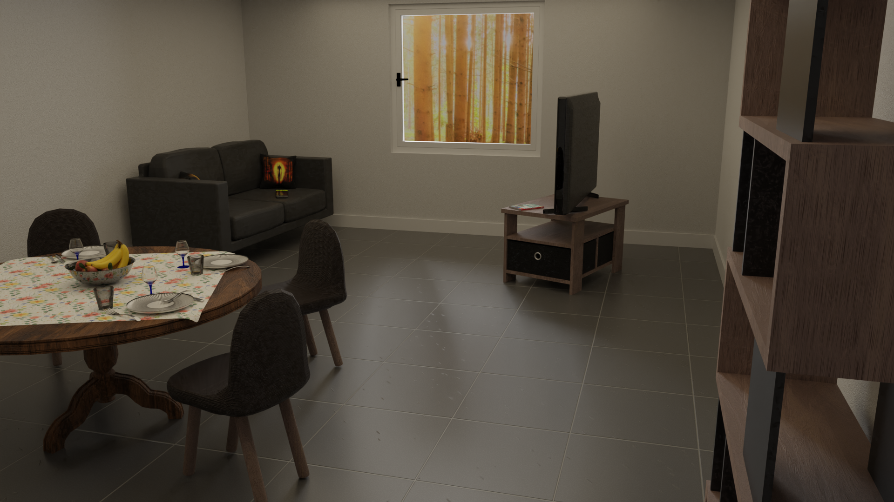
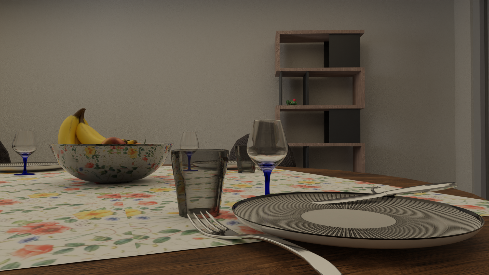
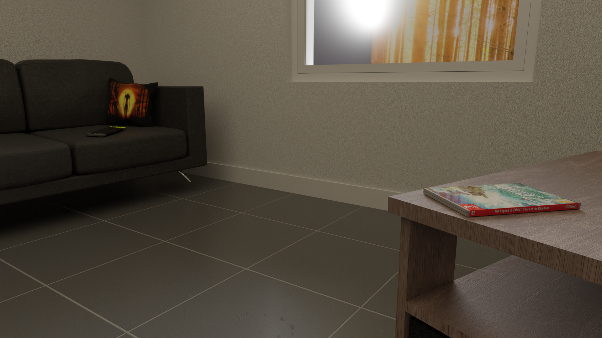
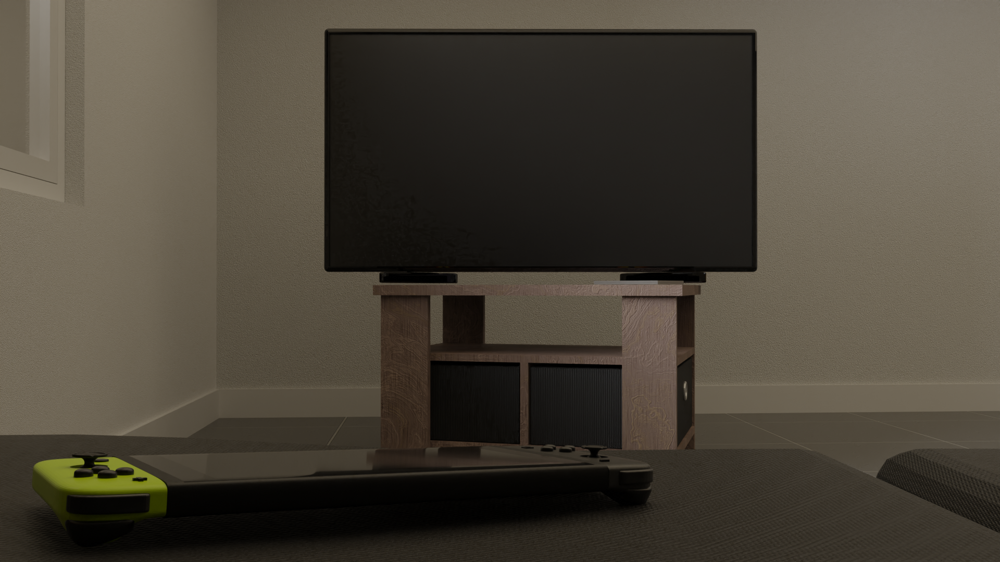
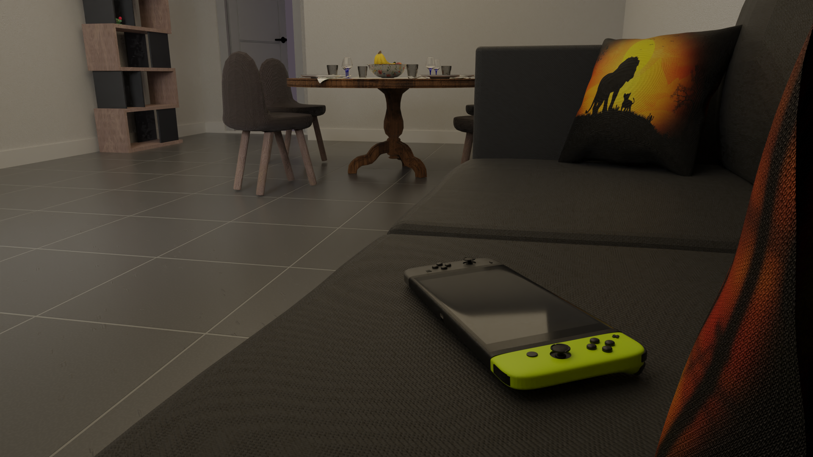
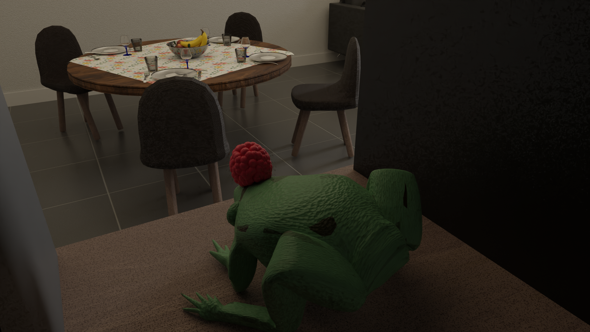

# appartment-blender
A blender modelisation of my student appartment during my studies at UTBM (Belfort, Bourgogne-Franche-Comté, France).

## Report

During my semester I wrote a report to explain all the things I have done in the project. It is only available in french just below :

[My report](#)

## Rendered images

I rendered some images you can enjoy just here. Feel free to generate some other if you want to :

<table>
  <tr>
    <td></td>
    <td></td>
  </tr>
  <tr>
    <td></td>
    <td></td>
  </tr>
  <tr>
    <td></td>
    <td></td>
  </tr>
</table>
