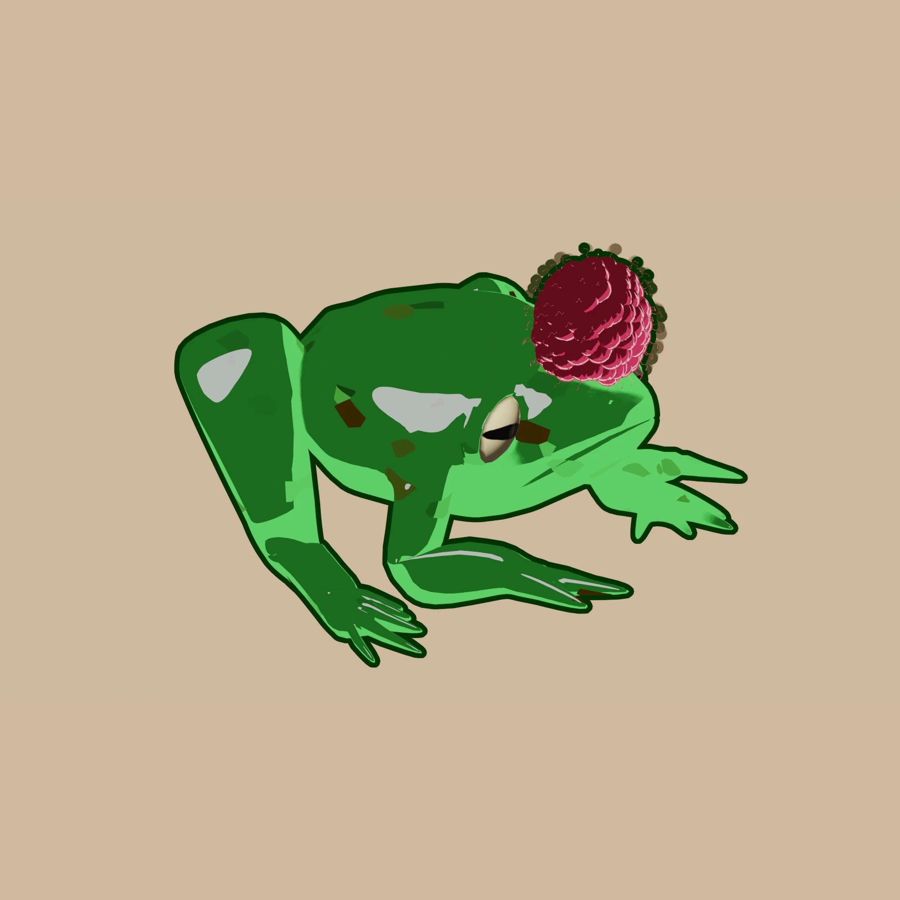
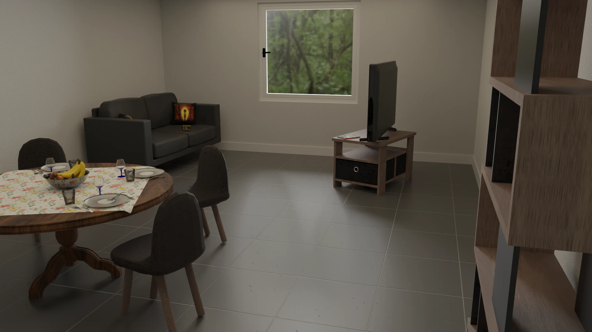
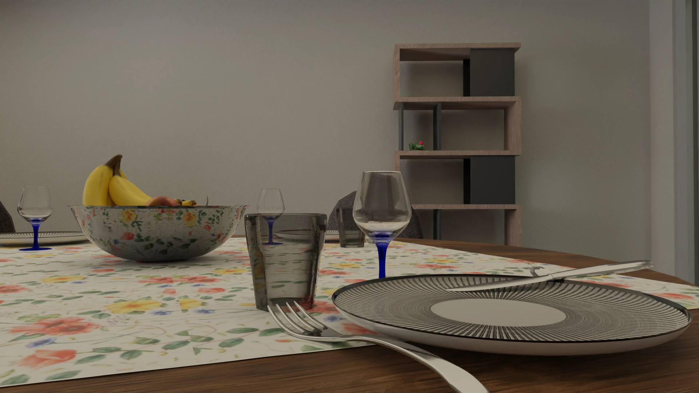
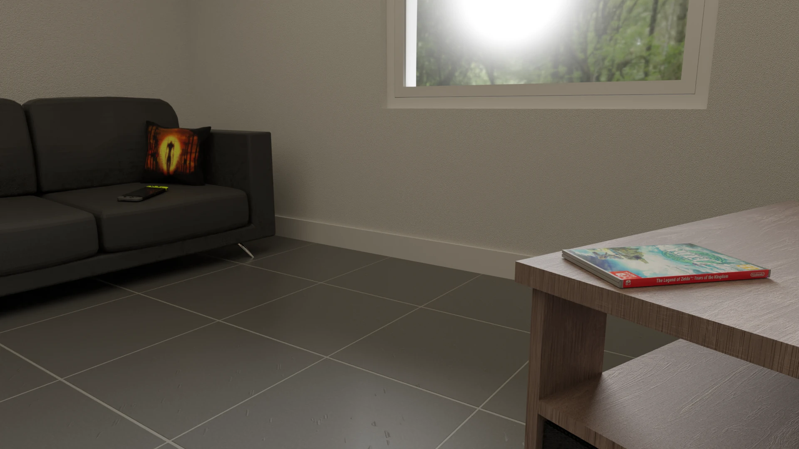
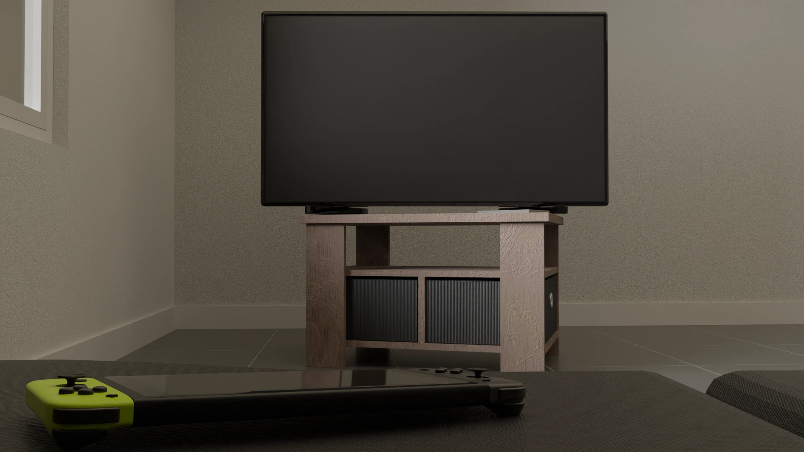
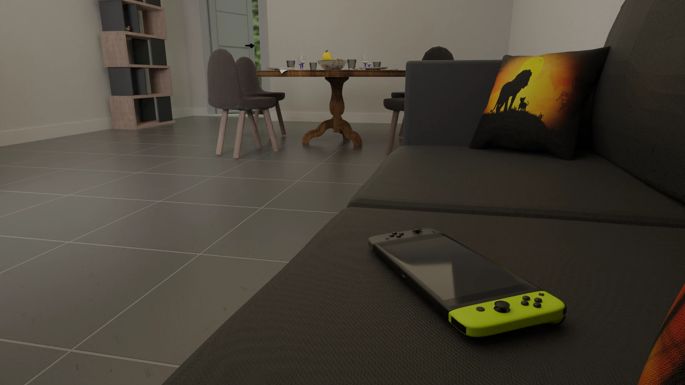
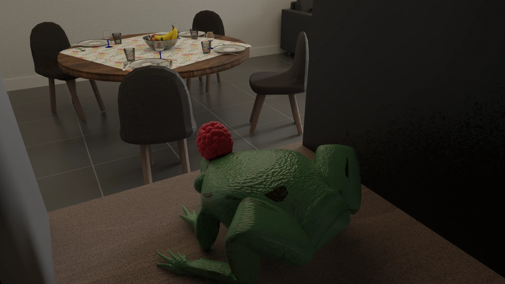

# appartment-blender
A blender modelisation of my student appartment during my studies at UTBM (Belfort, Bourgogne-Franche-Comté, France).

  

## Report

During my semester I wrote a report to explain all the things I have done in the project. It is only available in french just below :

  <a href="./report/2023_MV52_Viala_Alexandre.pdf" download>
    <kbd> 
       My report 
    </kbd>
  </a>

## Rendered images

I rendered some images you can enjoy just here. Feel free to generate some other if you want to :

<table>
  <tr>
    <td></td>
    <td></td>
  </tr>
  <tr>
    <td></td>
    <td></td>
  </tr>
  <tr>
    <td></td>
    <td></td>
  </tr>
</table>
